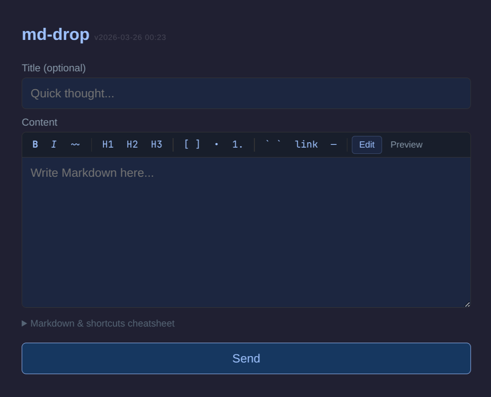

# md-drop

Capture Markdown content from anywhere and sync it into your Obsidian vault.



## How It Works

```
[Any Browser] --POST--> [Google Apps Script Web App] --> [Google Sheet]
                                                              |
[Any Email Client] --email--> [Gmail label: md-drop]          |
                                    |                         |
                                    +-------+    +------------+
                                            v    v
                                      [sync.py on laptop]
                                            |
                                            v
                                    [Obsidian Vault/Inbox/]
```

**Two input methods:**
- **Web form** — a Google Apps Script web app you can open on any browser (even devices you don't own). Access via a short memorable PIN URL (see [PIN-based access](#pin-based-access)).
- **Email** — send an email to your Gmail address (with an optional `+md` alias). The subject becomes the title, the body becomes the note.

**Storage buffer:** Google Sheets (for web submissions) and Gmail (for email). Both are always available and human-readable — you can open the Sheet or Gmail to see pending captures anytime.

**Sync client:** A Python script that runs on the machine with your Obsidian vault. It pulls pending content from both sources, writes `.md` files to your vault, and marks items as synced.

## Setup

### 1. Create the Google Sheet

1. Go to [Google Sheets](https://sheets.google.com) and create a new spreadsheet
2. Name it `md-drop-inbox` (or anything — the ID is what matters)
3. Rename the first sheet tab to `inbox`
4. Add headers in row 1: `timestamp | title | body | source | status | synced_at`
5. Copy the **spreadsheet ID** from the URL: `https://docs.google.com/spreadsheets/d/SPREADSHEET_ID/edit`

### 2. Deploy the Google Apps Script Web App

Install `clasp` (the Apps Script CLI):

```bash
npm install -g @google/clasp
clasp login
```

Create and deploy the web app:

```bash
cd appscript/
clasp create --title "md-drop" --type standalone --rootDir .
clasp push
```

For future deployments, use `deploy.sh` instead of `clasp push` directly — it stamps the version timestamp and redeploys in-place so your bookmarked URL never changes:

```bash
# Set once in your shell profile (~/.zshrc or ~/.bashrc):
export CLASP_DEPLOYMENT_ID="AKfycb..."   # from: clasp deployments

# Then deploy with:
cd appscript/
./deploy.sh
```

`deploy.sh` requires `CLASP_DEPLOYMENT_ID` to be set. Here's how to find and persist it:

**Finding the right deployment ID:**

```bash
clasp deployments
```

This lists all deployments, for example:
```
- AKfycbxxx @HEAD  "HEAD"
- AKfycbyyy @2     "md-drop 2026-03-26 00:23"
- AKfycbzzz @1     "md-drop initial"
```

The `@HEAD` entry is a scratch deployment used by the editor — ignore it. If you have several non-HEAD deployments (e.g. from earlier manual deploys), the `@number` is just a per-deployment redeploy count, not a global sequence — so the highest number is not necessarily the right one.

The correct ID is whichever deployment's URL is already embedded in `docs/index.html`:

```bash
grep GAS_URL docs/index.html
```

The URL contains the deployment ID: `…/macros/s/AKfycbXXX/exec`. Match that against the `clasp deployments` list. Going forward, `deploy.sh` will update that deployment in-place and the URL will never change. The other stale deployments can be removed with `clasp undeploy <ID>` if desired.

**Persisting the variable** so you don't have to set it each session:

```bash
echo 'export CLASP_DEPLOYMENT_ID="AKfycbyyy..."' >> ~/.zshrc
source ~/.zshrc
```

Alternatively, if you prefer not to touch your shell profile, you can hardcode it directly in `deploy.sh` (the ID is not a secret — it's already visible in the deployed URL).

Set the required Script Properties:

```bash
# Open the Apps Script editor in your browser
clasp open-script
```

In the Apps Script editor:
1. Go to **Project Settings** (gear icon) > **Script Properties**
2. Add `SHEET_ID` = the spreadsheet ID from step 1
3. Add `AUTH_TOKEN` = a random secret string (e.g., generate with `python -c "import secrets; print(secrets.token_urlsafe(32))"`)

Deploy the web app:
1. Click **Deploy** > **New deployment**
2. Type: **Web app**
3. Execute as: **Me**
4. Who has access: **Anyone**
5. Click **Deploy** and copy the URL

Your raw capture URL is: `https://script.google.com/macros/s/.../exec?t=YOUR_AUTH_TOKEN`

> **Important:** The URL from the deploy dialog is just `…/exec`. You must append `?t=YOUR_AUTH_TOKEN` (the value you set for `AUTH_TOKEN` in Script Properties) yourself. Without it, every submission will silently fail with "Invalid token".

**Recommended:** instead of bookmarking this long URL, set up a short PIN (see [PIN-based access](#pin-based-access) below).

### 3. Set Up the Gmail Filter

1. Open [Gmail](https://mail.google.com)
2. In the search bar, click the filter icon (or go to Settings > Filters)
3. Create a filter:
   - **To:** `your+md@gmail.com` (your Gmail address, optionally with a `+md` alias)
4. Choose action:
   - **Apply the label:** `md-drop` (create it if it doesn't exist)
   - **Skip the Inbox** (optional, keeps your inbox clean)
5. Save the filter

Now any email sent to that address will be automatically labeled.

### 4. Set Up Google Cloud OAuth (for the sync client)

The sync client needs OAuth credentials to access the Sheets API and Gmail API.

1. Go to [Google Cloud Console](https://console.cloud.google.com)
2. Create a new project called `md-drop`
3. Enable the **Google Sheets API** and **Gmail API**:
   - Go to **APIs & Services** > **Library**
   - Search for and enable both APIs
4. Create OAuth credentials:
   - Go to **APIs & Services** > **Credentials**
   - Click **Create Credentials** > **OAuth client ID**
   - Application type: **Desktop app**
   - Name: `md-drop`
   - Download the JSON file
5. Place it at `~/.config/md-drop/credentials.json`

> **Note:** You may also need to configure the OAuth consent screen (under APIs & Services > OAuth consent screen). Set it to "External" and add yourself as a test user. This is a one-time setup.

### 5. Install the Sync Client

**Recommended:** use [pipx](https://pipx.pypa.io/) to install `md-drop` as a global command without managing a venv yourself:

```bash
pipx install /path/to/md-drop
```

`md-drop` will be available on your PATH (via `~/.local/bin/`). To update after pulling changes: `pipx reinstall md-drop`.

**For development** (editable install):

```bash
cd /path/to/md-drop
python3 -m venv .venv
source .venv/bin/activate
pip install -e .
```

### 6. Configure the Sync Client

Create `~/.config/md-drop/config.toml`:

```toml
[vault]
path = "/path/to/your/obsidian/vault"
strategy = "inbox"        # "inbox" = individual files, "daily" = append to daily note
inbox_folder = "Inbox"

[google]
credentials_file = "~/.config/md-drop/credentials.json"
token_file = "~/.config/md-drop/token.json"
sheet_id = "YOUR_SPREADSHEET_ID"

[gmail]
enabled = true
label = "md-drop"
synced_label = "md-drop-synced"

[sync]
interval_seconds = 300
```

> **Note:** The config file is read on every run — edit it and the next sync picks up the changes automatically. No reinstall needed for config changes; `pipx reinstall md-drop` is only required when pulling new code.

### 7. First Run (OAuth)

```bash
md-drop --once --verbose
```

This will open a browser window for Google OAuth consent. Log in and grant access. The refresh token is saved to `~/.config/md-drop/token.json` — you won't need to do this again.

### 8. Set Up Automatic Sync

Add a cron job on the machine with your Obsidian vault:

```bash
crontab -e
```

Add:

```
*/5 * * * * ~/.local/bin/md-drop --once >> ~/.local/log/md-drop.log 2>&1
```

Or use a systemd user timer for more control:

```ini
# ~/.config/systemd/user/md-drop.service
[Unit]
Description=md-drop sync

[Service]
ExecStart=%h/.local/bin/md-drop --once
```

```ini
# ~/.config/systemd/user/md-drop.timer
[Unit]
Description=md-drop sync timer

[Timer]
OnBootSec=1min
OnUnitActiveSec=5min

[Install]
WantedBy=timers.target
```

```bash
systemctl --user enable --now md-drop.timer
```

## Usage

### Web Form

Open your bookmarked URL on any device. Type a title (optional) and your Markdown content, then hit Send.

The form includes a Markdown toolbar and keyboard shortcuts for common formatting. Press `Ctrl+P` to toggle a live preview. A collapsible cheatsheet at the bottom lists Markdown syntax and all available shortcuts.


### Email

Send an email to your Gmail address (the one you set up the filter for; e.g., `myaddress-md@domain.com`) from any email client. The subject line becomes the note title, and the email body becomes the content. HTML emails are automatically converted to Markdown.

### Manual Sync

```bash
# Dry run — see what would be synced
md-drop --once --dry-run

# Sync once
md-drop --once

# Run in a loop (every 5 minutes by default)
md-drop

# Verbose output
md-drop --once -v

# Custom config file
md-drop --config /path/to/config.toml --once

# Override vault path
md-drop --vault /tmp/test-vault --once
```

## Vault Output

### Inbox Strategy (default)

Each capture becomes its own file in `Vault/Inbox/`:

```
Vault/
  Inbox/
    2026-03-25-quick-thought-about-api-design.md
    2026-03-25-article-to-read-later.md
```

Each file has YAML front matter:

```yaml
---
date: '2026-03-25T14:32:00+00:00'
source: web
tags:
- inbox
title: Quick thought about API design
---

The actual content here...
```

### Daily Strategy

Captures are appended to today's daily note under a `## Captures` heading:

```markdown
# 2026-03-25

## Captures

### 14:32 (web)
**Quick thought about API design**
The actual content here...

### 15:10 (email)
**Article to read later**
Check out this article...
```

## PIN-based access

The GAS deployment URL contains a long, unmemorizable deployment ID, and the capture URL appends `?t=AUTH_TOKEN` on top of that. To avoid having to remember or retype either, you can use a short PIN instead.

**How it works:**

```
maciekk.github.io/md-drop?pin=sunshine7
  → (GitHub Pages JS) → script.google.com/…/exec?pin=sunshine7
  → (GAS validates PIN, renders form directly with AUTH_TOKEN embedded)
  → form loads, ready to submit
```

The only thing you need to remember or type is `[username].github.io/md-drop?pin=yourpin`. The AUTH_TOKEN and deployment ID never appear in any URL you type.

**Setup:**

1. Add a `PIN` Script Property in the Apps Script editor (alongside `AUTH_TOKEN` and `SHEET_ID`). Choose a short memorable value.

2. Enable GitHub Pages on this repo: **Settings > Pages**, source: `master` branch, `/docs` folder.

3. Your entry point is: `https://[username].github.io/md-drop?pin=yourpin`

> The `docs/index.html` in this repo is the GitHub Pages redirect page. It reads `?pin=` and forwards to the GAS URL. The GAS deployment ID is visible in that file's source, but that's harmless — without a valid PIN or token, submissions are rejected server-side.

## Security

- The web form URL contains a secret token. Anyone with the full `?t=AUTH_TOKEN` URL can submit. Keep it private — treat it like a password.
- If using the PIN approach, the PIN is the secret to protect. The AUTH_TOKEN stays server-side.
- To rotate the token: update `AUTH_TOKEN` in Script Properties. If using PIN, you can also rotate the PIN independently.
- OAuth credentials and refresh tokens are stored locally at `~/.config/md-drop/`. Keep this directory secure.
- The Google Sheet is accessible only to your Google account.

## Troubleshooting

**"credentials file not found"** — Download OAuth credentials from [Google Cloud Console](https://console.cloud.google.com) and place at `~/.config/md-drop/credentials.json`.

**Form resets to "Send" with no error message** — Your URL is missing the `?t=YOUR_AUTH_TOKEN` suffix. The token must be in the URL you open the form with, not just set in Script Properties.

**"Invalid token" on web form** — The `AUTH_TOKEN` Script Property doesn't match the `?t=` parameter in your URL. Check both.

**Gmail label not found** — Create the `md-drop` label in Gmail manually, or send a test email to your address and the filter will create it.

**OAuth token expired** — Delete `~/.config/md-drop/token.json` and run `md-drop --once` to re-authenticate.

**"SHEET_ID not configured"** — Set the `SHEET_ID` Script Property in the Apps Script editor.

**Duplicates appearing** — The sync client deduplicates by content hash within each run, but if the same content is submitted multiple times across runs (and already synced), it won't prevent re-creation. Items are marked as synced in the source (Sheet/Gmail) so they won't be re-processed.
